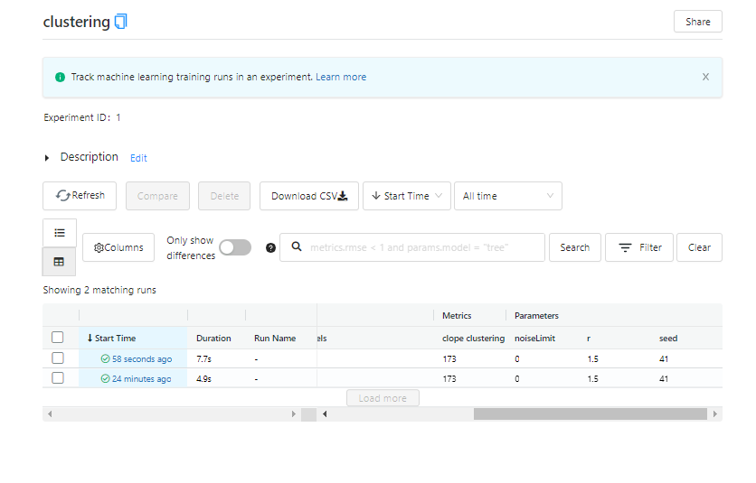

**Для запуска необходимо выполнить:**

1. `docker-compose build` - создаст образы
2. `docker-compose up` - создаст контейнеры и запустит проект

Когда всё отработало можно открыть mlflow ui: `http://{docker-ip}:5000`

